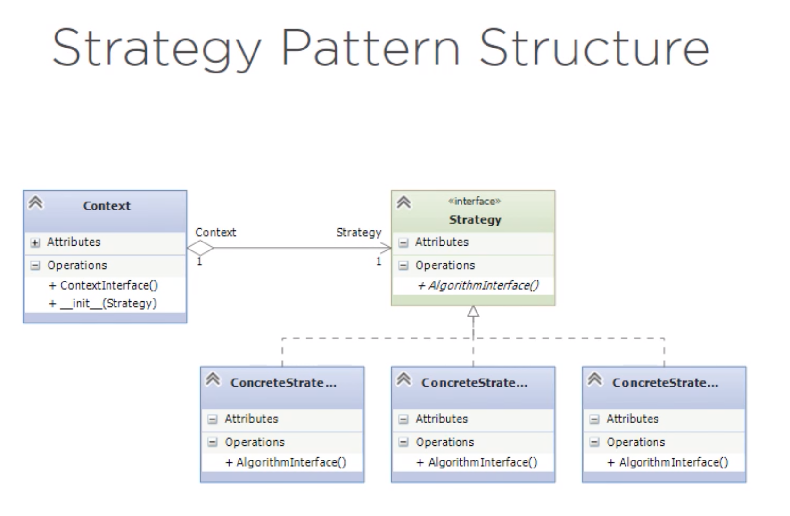
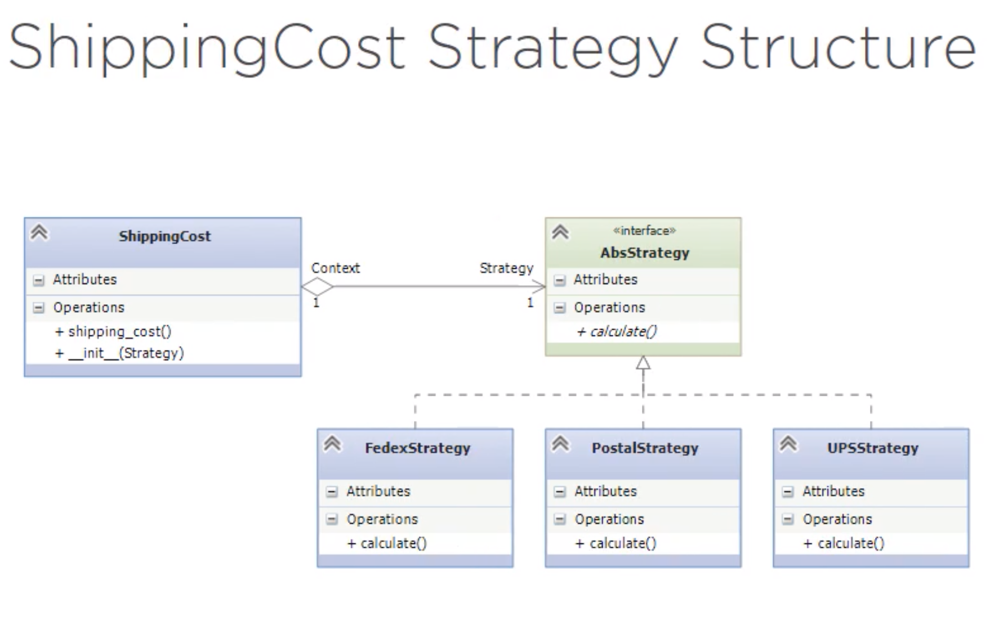

# Strategy (Policy) Pattern 

It is a **BEHAVIORAL** pattern.

1. Takes a family of algorithms.
2. Encapsulates each one of them.
3. Make those algorithms interchangeable.

Since the algorithms are a family, they usually operate with the same set of *inputs* and *outputs*.

*Calculating gravitational attraction using Newton's formula or Einstein's general relativity does have different implementations but inputs and outputs are the same*

## Structure

## Exercise

A **Shipping cost calculator** that must support 3 methods:
- Federal Express
- UPS
- Postal Service
Must be extendable (add new shippers)

### Solution:

See the implementation in `/after`

## Variations

We used strategy as objects but we can also use:
- Strategies as functions
- Strategies as lambdas

See these variations in `/after-alternative`