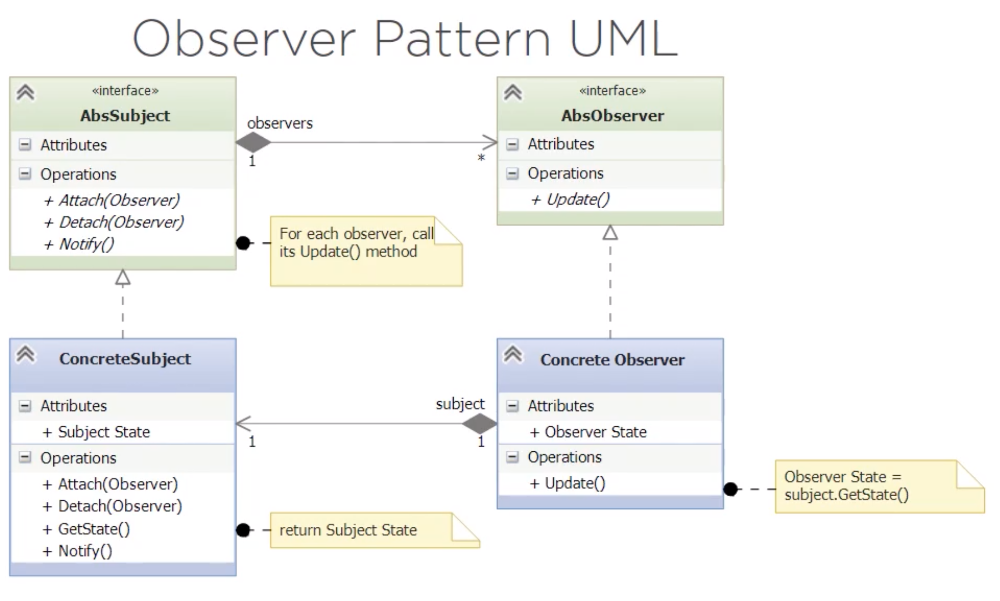

# Observer (Dependents/Publish-Subscribe) Pattern 

It is a **BEHAVIORAL** pattern.

1. Defines a *one-to-many* relationship between a set of objects 
2. When the state of one object changes, its dependents are notified

It's commonly used in GUI applications (i.e observers have to be notified about keyboard entries).

The classic **MVC (Model-View Controller)** pattern uses the **Observer** pattern.
- *Model = Subject* 
- *View = Observer*

*i.e. An subscriber is notified when there's a new video on a Youtube channel*

## Structure

## Exercise

A Dashboard for a tech support center that shows KPIs:
- Open tickets/issues
- New tickets inn last hour
- Closed tickets in last hour

The Dashboard is the *Observer*.
The KPI source is the *Subject/Publisher*

*Other observers can be added (i.e one that shows the historical average)*

### Solution:

See the implementation in `/after`

### Correction to Solution:

***Note:***
*This implementation has a bug.*
*Python uses reference counters for objects (when the counter == 0, it calls garbage collector).*
*We use a set of observers that hold the references (counter > 0 always) and garbage collector is never executed.*
*See solution to this on `/after-alternative` using **context managers**.*

Using context managers, we have:

1. Added `__enter__()` and `__exit__()` methods to the `ABCObserver` and `ABCSubject` classes to convert them into a **context manager**.
- The `__exit__()` method in `ABCObserver` is abstract so the observers concrete classes have to implement it.
2. The `CurrentKPIs` and `ForecastKPIs` classes now implement the `__exit__()` abstractmethod. 

## Assignment

In the classic observer pattern, state values are **pulled** from the subject by the observer. 
It is also possible to **push** values from the subject to each observer when state changes.

The `ABCSubject` abstract base class that is used in the module has support for operating in push mode. 
