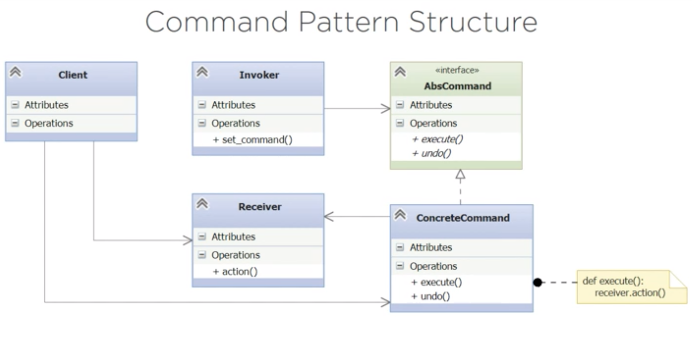

# Command (Action/Transaction) Pattern 

It is a **BEHAVIORAL** pattern.

1. Encapsulates a *request* as an *object*.
2. This let's us parameterize various objects with different requests. 

*i.e. Allows to implement **queues** and **log** operation.*

## Structure

## Exercise

A command line order proccessing program that has 3 operations:
- CreateOrder
- UpdateQuantity
- ShipOrder

The program should:
1. Parse the command line arguments.
2. Execute the commands.
3. Notify the user and log the results.

*Other operations can be added later (i.e. a DeleteOrder function)*

### Solution:

See the implementation in `/after`

*Note: The Strategy Pattern could be used if the command methods didn't have different signatures*

## Assignment

You are working on a new app that is sure to be best seller. One part of the project concerns a menu of actions that can be executed. The same actions need to be able to be undone as well.

Classes containing the menu actions have been written and supplied to you. (You can find them in the package called actions in the Solution subdirector.) For each class there are methods that can perform some action and the action's counterpart. For example, a coffee maker can be turned on or turned off. 

Your task is to write a MenuAction class that can perform the actions and undo them without knowing the particulars of the actions, their effects or how to undo those effects. Also, you need to support multi-level undo. (e.g if action1 and action2 are performed in order, undoing them must be in reverse order, i.e. action2, action1).

Your think that the Command pattern may help simplify things and separate the concerns of the MenuAction class from the individual actions. 

You've also been given a started abstract command class.

Implement and test the MenuAction class. 