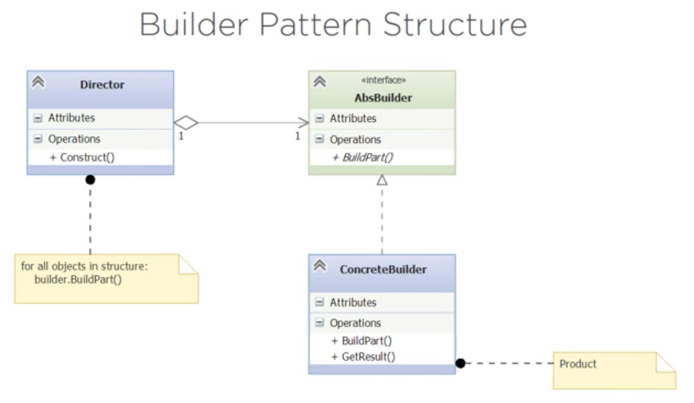

# Builder Pattern

It is a **CREATIONAL** pattern.

1. Separates **construction** of an object from its **representation**.
2. Encapsulates the object construction.
3. Implementations can vary.
    - The clients sees only the abstraction.

## Structure

## Exercise

Custom computer builder. 
- Can have many components (that can lead to bad design choices).

### Solution:

1. `/before`: has a first attempt of an implementation without the Builder pattern. There's a `Computer` class that has a very **big** constructor that is hard to maintain. 
2. `/before2`: another attempt without a constructor but instead sets the attributes in the `__main__.py` file. Now we don't have the problem with too many constructor parameters but we do have one problem about directly setting attributes in the client's program. 
3. `/before3`: Now computer components encapsulated in a separate class `MyComputer`. Previous problems are fixed but now we cannot install it in a different order. 
4. `/before4`: Now we can install the computer in different orders inside the `MyComputerBuilder` class but we cannot create different computers.

## Assignment

You work for a pizza shop. There are many kinds of pizzas on the menu. However they all have the same basic composition. There's a crust (regular on whole wheat, thick or thin), a base (tomate sauce or white sauce), meat toppings (pepperoni, sausage, bacon), vegetable toppings (tomatoes, onions, peppers, olives) and cheese toppings (mozarella, provolone, quattro fromaggi).

You have a favorite (whatever you like -- hey!  you work there!) but know that other customers prefer other kinds. One customer favoritie is the whole-wheat, thin crust pizza with a tomato base, sausage, onions and olives topped with provolone.

You need to build a program that will construct and display pizza objects. Be sure to include your favorite and at least that one customer favorite, though you know other combinations will be asked for in the future.
