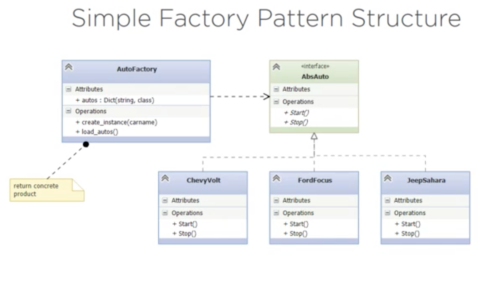
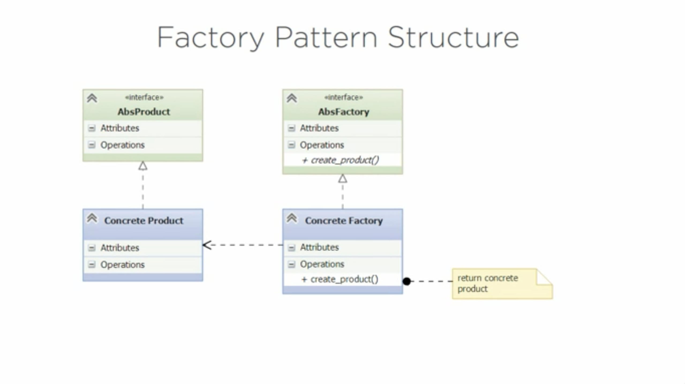

# Factory (Virtual Constructor) Pattern

It is a **CREATIONAL** pattern.

1. Defines an interface for creating an object.
2. Let subclasses decide which object to create. 
3. Defer instantiation to the subclasses. 

## Structure

1. Simple Factory Pattern's structure:

2. Classic Factory Pattern's structure:

## Exercise

Create an object for a model of a car. 
- Support several car models. 
- We don't know which one we need until runtime. 

### Problems detected

1. If/elif clauses for the `get_car()` function to check which model the car given belongs to. 
2. If a new model is added, modifications have to be done to the `__main__.py` file (imports, if/elif clauses)

### Solution:

1. `simple_factory` has the implementation of the Simple Factory Pattern.
- It is limited to only one factory.