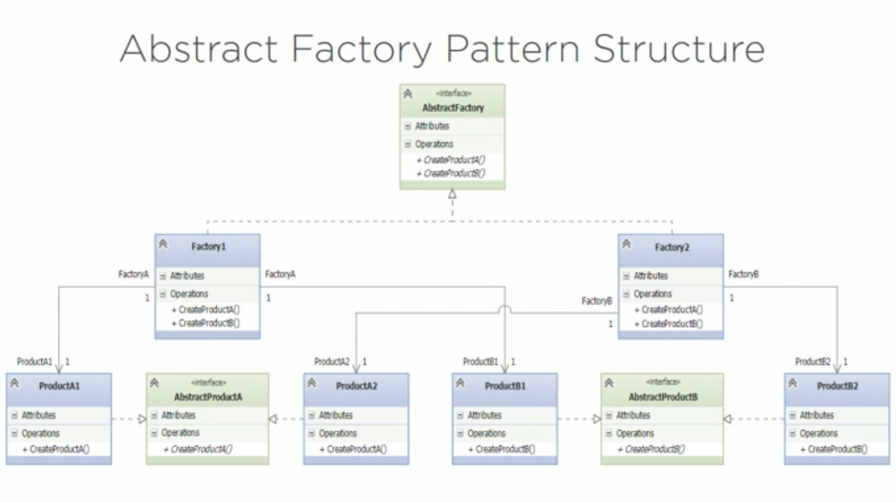

# Abstract Factory (Kit) Pattern

It is a **CREATIONAL** pattern.

1. Defines an interface for creating a FAMILY OF OBJECTS.
2. Enforces dependencies between classes.
3. Defer instantiation to the subclasses. 

***Factory** is great when we don't know which concreet classes we'll need*
***AbstractFactory** is useful when we have families of similar objects*

## Structure

1. Abstract Factory Pattern's structure:

## Exercise

Create an collection of car factories
- One manufacturer per factory.
- Each factory can make different models:
    * Economy
    * Sport
    * Luxury
- Support several manufacturers. 

### Problems detected

1. If/elif clauses.
2. Too many imports at the top of the main file (violates the open-close principle)

### Solution:

1. `abs_factory` has the implementation of the Simple Factory Pattern.
