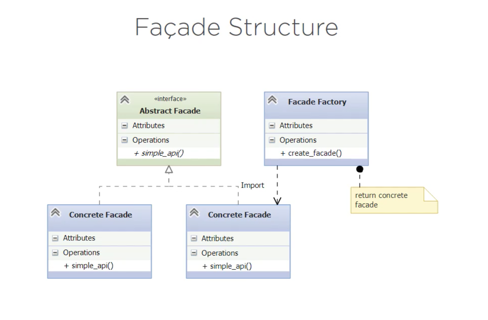

# Facade Pattern 

It is a **STRUCTURAL** pattern.

Puts a new face on something. (Unified interface to a set of interfaces)
It is a Higher-level interface (Makes the set of interfaces easier to use. Reduces Complexity)

## Structure

1. Abstract Factory Pattern's structure:

For the exercise proposed, there's an abstract facade base class and different concrete facade classes can implement different modes (the facades) like mssql, postgresql... and ALL of them implement the abstract facade and its methods. 

Client programs will call the Facade Factory to get an instantiated facade to use.

## Exercise

Access a database (i.e to get employee records).
We would need to ask DBA which database to use and import the right python modules to support it. 
Then instantiate a control object to interact with the DB which means build a connection string, run a query and process the results. Finally disconnect and release any records used. 

Retrieve and print employee records using Adventure Works database (https://goo.gl/QCgJBW).

### Solution:

In the `/before/get_employees.py` solution the interfaces are **connect**, **cursor**, **execute**, **commit**, and **close**.

See the implementation in `/after`. There's a subdirectory `/get_employees` that contains a python package that holds the facades. 
