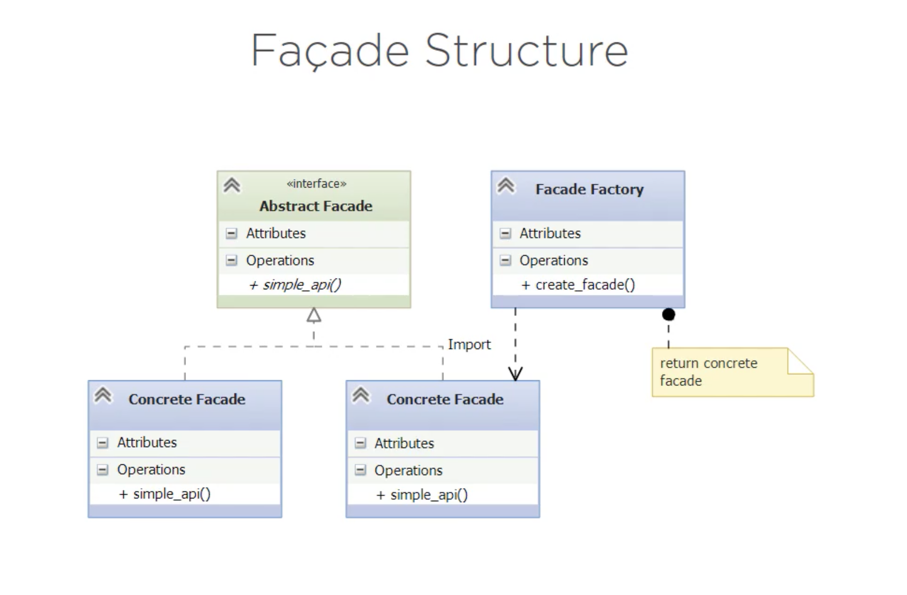

# Adapter (Wrapper) Pattern 

It is a **STRUCTURAL** pattern.

1. Used to convert one interface into another one that the client expects. 
2. Lets classes work together even if their interfaces are **incompatible**.
3. There are 2 kinds of adapters: 
    - **object adapters** (use composition and can easily work with subclasses or parent classes)
    - **class adapters** (use inheritance and let the adapter override some of the class methods)
    *Note:* try to favor composition (object) over inheritance (class) as it easier to understand and maintain. 

## Structure

1. Abstract Factory Pattern's structure:

## Exercise

A program that prints *customer* names and addresses. We need it to support *vendors* as well.

### Solution:

In the `/before` solution there's a vendor class that separates number and street from the vendor's address (unlike the customer class that has them merged into one).

**BUT** if we ever need to add a third type we would need to add even more logic to the `__main__.py` file. 

See the implementation in `/after`. There's a subdirectory `/get_employees` that contains a python package that holds the facades. 
